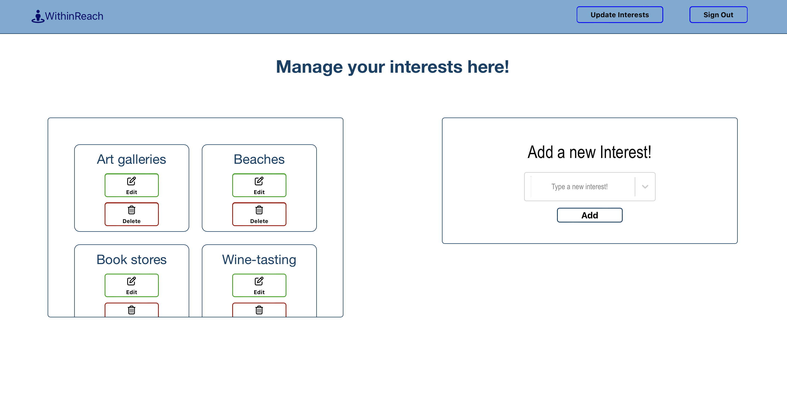
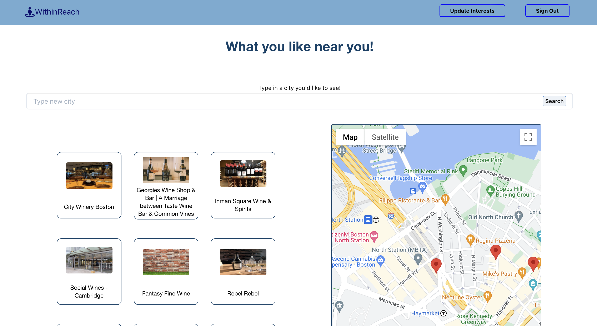

<div align="center">

# WithinReach 

<a href="https://within-reach-10b07fcd97a3.herokuapp.com"><br/>Link to website! </a>

WithinReach is a location-based platform that instantly provides personalized recommendations for tailored places, events, and experiences; Eliminating the need for extensive searching. The Google Maps API has been integrated into a React web app with a PostgreSQL database. API requests are made from the React frontend to the Express backend using the 'fetch' method, and third-party API requests are handled using the 'got' library on the backend.

</div>
<div align="left">

-   [🌱 Install](#-install)
-   [🚀 Features](#-features)
-   [🌴 Technologies](#-technologies)

## 🌱 Install

Prerequisites

1. Install <a href="https://git-scm.com/book/en/v2/Getting-Started-First-Time-Git-Setup">Git</a> if you don't already have it.

2. Install yarn via npm

```bash
npm install --global yarn
```

3. Install <a href="https://www.postgresql.org/download/" >PostGreSQL</a>

4. Use Git to clone the repository

```bash
git clone https://github.com/Gkimbo/within-reach.git
```

5. Run yarn install

```bash
cd within-reach
yarn install
```

6. Create database with

```bash
createdb within-reach_development
```

7. Run migration with

```bash
yarn run migrate:latest
```

8. Seed the Database

```bash
yarn run db:seed
```

9. Create a `.env` file in the server of your project:
   Run in the terminal

```bash
cd server
touch .env
```

10. Copy the keys from the .env.example file into it and add your own api keys.
    <br/>
    You will need keys from the following websites:
    <br/>
    <a href="https://api-ninjas.com/api/city">API-Ninja</a>
    <br/>
    <a href="https://unsplash.com/developers">Unsplash-API</a>

You will also need the google maps api key!

11. Once you're done all that its time to launch the app

```bash
yarn run dev
```

12. Finally navigate to http://localhost:3000 in your browser and make sure you're all set!

## 🚀 Features

1. Landing Page: When a user visits the website, they will see the landing page. This page will describe the app and have a form for signing in. Under the form, there is a link to allow the user to sign up.
   <a href="https://within-reach-10b07fcd97a3.herokuapp.com/landing"></a>

2. In order to sign up the user will have to fill out all fields and pick at least on thing that interests them:

    - Once registered the user will be redirected to the home page.

3. Home Page: When a logged-in user visits the home page, they will be able to see three different features:

    - A button that, when pressed, will take the user to a map displaying points of interest around them.
    - A list of activities that the user can select. Upon selecting an activity, the user will be shown a map of places where they can engage in that activity.
    - A list of popular destinations with city names and scrolling pictures. If the user selects a city, they will be directed to a map of that city displaying their points of interest.

    <a href="https://within-reach-10b07fcd97a3.herokuapp.com"></a>

4. Update Interests: Users can update their interests at any time. In the navigation bar at the top of the page, there is a button called "Update Interests" that will direct the user to a page with a list of their interests and a form on the right to add new interests.

    - In the list of the user's interests, they can click on an edit button to modify that interest, and a delete button to remove it.
    - Clicking the edit button will replace the "Add New Interest" form with an edit form.
    - The user can always click a button under the edit form to return to the "Add Interest" form.

    <a href="https://within-reach-10b07fcd97a3.herokuapp.com/manage-preferences"></a>

5. Map: Users can access any map from any page by clicking the icon in the top left of the navigation bar. This action will take the user to the home page, where they can click on the "Click Me for Things to Do!" button, leading them to a map displaying nearby points of interest.

    - On the map page, a search bar at the top allows the user to enter any city and view their points of interest on the map.
    - Additionally, the map page presents a list of interesting things around the user to the left of the map.
    - Clicking on one of the points of interest will expand its details, providing the user with more information, including the address of the attraction.

    <a href="https://within-reach-10b07fcd97a3.herokuapp.com/my-activities"></a>

## 🌴 Technologies

React , Node.js , Express , JavaScript , HTML , CSS , PostgreSQL , Knex/Objection , Foundation , Font-Awesome, Google Maps API, API-Ninja, Unsplash API.

If you would like to contribute to this code base:

Follow the 'Install' instructions to clone the repository from GitHub.
To prevent unwanted modifications of the application:
Create a new git branch to refactor existing features, or implement any new features.
Send pull request for review and consideration of merging the new features into the main application branch.

Know what there is to do around you at all times. Fun things are just one click way.

</div>
